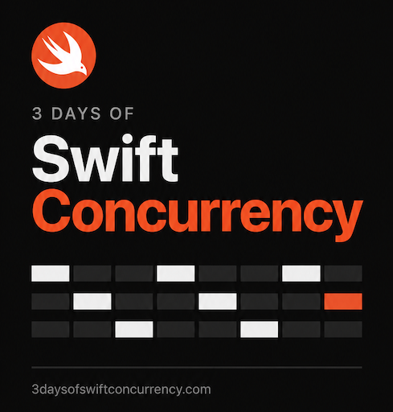

[](https://www.3daysofswiftconcurrency.com/)

# Cooperative Feature Architecture (CFA)

**Created and published by [3DaysOfSwiftConcurrency.com](https://www.3daysofswiftconcurrency.com/) — a free, open-source gift to the iOS development community.**

## What is this AI Skill?

**CFA is a toolkit of four AI skills and one architecture dashboard tool for iOS developers who build applications with AI.** It gives you and your coding agent a shared architecture to follow when creating an Xcode project, improving an existing app or migrating legacy code.

An **AI skill** is a set of instructions and supporting resources that your coding agent loads for a specific job. CFA’s skills tell the agent where code belongs, which component owns each responsibility, how to preserve existing behaviour and what to verify before calling the work complete. The **dashboard tool** reads Swift source and produces a report that helps you inspect the result.

This is a modern approach to developing maintainable iOS applications with AI-generated code. Instead of asking the agent to invent the project structure with every change, you give it a consistent template: screens handle presentation, feature managers own business behaviour, and dependencies have defined boundaries. That structure is designed to improve readability, make feature enhancement easier and reduce AI coding mistakes caused by scattered responsibilities or components reaching into one another.

**Use this toolkit to adopt CFA, migrate a legacy GCD codebase to Swift Concurrency, and build toward higher-quality commercial iOS applications with AI.** You can use each skill independently or apply them in stages to the same project.

CFA supports Swift Concurrency through explicit state ownership, actor isolation and task lifetimes. It provides project structure and development guidance; your app does not need to link a CFA runtime library.

**Four skills · One tool · MIT licensed · 0.2.0 beta**

## Why this architecture?

- **Give AI a repeatable template.** The developer and coding agent work from the same folder structure, ownership rules and review criteria.
- **Make the code easier to read.** Find a feature’s behaviour and state through a named owner instead of tracing unrelated components throughout the project.
- **Make feature changes easier to maintain.** Clear boundaries show where a change belongs and which callers need to be checked.
- **Reduce architectural guesswork.** Concrete rules help prevent duplicated business logic, misplaced state and unnecessary layers in AI-generated code.
- **Keep components from becoming tangled.** Features expose deliberate interfaces rather than allowing arbitrary access to one another’s internals.
- **Put Swift Concurrency to work deliberately.** Identify who owns mutable state, asynchronous work, cancellation and results that arrive out of order.
- **Preserve behaviour during migration.** Record the app’s existing requirements and verify them as the implementation changes.
- **Review the result with evidence.** Inspect source-linked findings and distinguish architectural judgments from executed tests.

## How to install

1. **Choose the plugin download.** Get the `cooperative-feature-architecture-<version>-plugin.zip` archive. Use the plugin ZIP for installation; the source ZIP is for developing the toolkit. Hosted release links will be added when the repository is published.

2. **Check the prerequisites.** Install Node.js 20 or newer and a Codex CLI that supports `codex plugin add`. Building and testing iPhone apps also requires a Mac and Xcode. These applications are not bundled with CFA.

3. **Extract the ZIP.** Keep the extracted `cooperative-feature-architecture` folder intact so the skills can find their references and dashboard tool.

4. **Run the installer.** Open Terminal in the extracted folder and run:

   ```sh
   node scripts/install.mjs
   ```

   On macOS, you can also open `Install.command` in that folder. The installer copies the plugin into your personal plugin location and asks Codex to activate all four skills. If activation fails, it reports the error and provides a retry command.

5. **Open a new Codex conversation with your Xcode project.** Choose the skill for your task and use one of the prompts below. For example:

   ```text
   Use $cfa-architecture-review to review this app without changing its source.
   ```

**Using another compatible coding agent?** Run `node scripts/install.mjs --mode skills` instead of the plugin installation command. This places four self-contained skill folders under `~/.agents/skills`; check your agent’s skill-discovery requirements.

See [installation and upgrades](docs/INSTALLATION.md) for existing installations, custom locations and troubleshooting. Users of the original two-skill release should read its upgrade section first.

## Skill 1 — CFA App Creation

**Build a new iOS app with CFA from the first working feature.**

This skill guides the agent through creating the Xcode project, applying the folder structure and connecting a screen to its ViewModel, feature behaviour and dependencies. It aims for a working user journey with relevant build and test evidence, rather than a collection of empty components.

```text
Use $cfa-app-creation to create a SwiftUI iPhone app using CFA.
My app is called Notes. Build the first working note-creation feature.
```

[Read the App Creation skill](skills/cfa-app-creation/SKILL.md)

## Skill 2 — CFA Architecture Adoption

**Bring an existing application into CFA while preserving what the app does.**

This skill maps the current responsibilities, establishes a behaviour baseline and restructures one feature at a time. It separates screen state from business rules and gives each feature’s state and behaviour an explicit owner. It also supports bringing existing CFA features back into alignment.

```text
Use $cfa-architecture-adoption to adopt CFA in this existing app.
Preserve its behaviour and begin with one complete feature.
```

[Read the Architecture Adoption skill](skills/cfa-architecture-adoption/SKILL.md)

## Skill 3 — Swift Concurrency Migration

**Migrate GCD, operation queues and callbacks to Swift Concurrency.**

This skill identifies the guarantees supplied by existing concurrency code—such as ordering, protected state, cancellation and error delivery—and guides the agent to preserve them during migration. It checks execution ownership and suspension boundaries rather than mechanically replacing queue calls with tasks.

You can use it with an existing architecture. **Concurrency migration does not automatically adopt CFA or replace the UI framework.**

```text
Use $swift-concurrency-migration to migrate this app’s GCD code.
Preserve its current architecture, behaviour and operation ordering.
```

[Read the Swift Concurrency Migration skill](skills/swift-concurrency-migration/SKILL.md)

## Skill 4 — CFA Architecture Review

**Understand whether the implementation follows the intended architecture and where it needs attention.**

This skill inspects feature ownership, live dependency wiring and concurrency boundaries without refactoring the app. It reports source-linked findings, their consequences and recommended changes. It can review legacy GCD apps manually and use the dashboard tool for supported Swift Concurrency projects.

```text
Use $cfa-architecture-review to review this app’s feature ownership
and concurrency boundaries. Report findings without changing app code.
```

[Read the Architecture Review skill](skills/cfa-architecture-review/SKILL.md)

## The tool — Xcode Project Dashboard

The toolkit’s executable tool scans Swift source and generates a local HTML dashboard and structured report. The review skill uses that inventory to explain task creation, operation journeys, separation of responsibilities and test evidence.

The scanner finds source patterns. The reviewing developer or agent supplies the reasoning behind findings and ratings; the tool does not compile Swift or prove that an application is race-free.

You can also run the bundled scanner directly with Node.js:

```sh
node skills/cfa-architecture-review/scripts/dashboard/src/cli.mjs /path/to/app --out /path/to/new-report
```

## The architecture behind the skills

```text
View → dedicated ViewModel → Feature API → Feature Manager → Repository
```

`AppModel.shared` is the production composition root: it brings the app’s feature dependencies together. Each feature owns its business state and behaviour; screen-specific presentation state stays in its ViewModel.

The [CFA specification](architecture/cfa-specification.md) defines the folder map, ownership rules and review checklist. It is maintained centrally and bundled into the skills that need it. Swift Concurrency does not require CFA or one actor per feature; CFA supplies a consistent way to organise responsibilities when using it.

## The publisher and its training

[](https://www.3daysofswiftconcurrency.com/)

**[Explore the training at 3DaysOfSwiftConcurrency.com →](https://www.3daysofswiftconcurrency.com/)**

3 Days of Swift Concurrency offers Swift Concurrency training for iOS developers. CFA shares its approach to maintainable application structure as a free, open-source gift to the industry. You can use the toolkit in personal and commercial projects; no course purchase is required.

## Status and evidence

CFA is a beta toolkit. Its packaging tests and skill validators pass; end-to-end app creation and migration trials and native Codex activation remain validation gaps. See the [validation record](docs/VALIDATION.md). Architectural rules support better work, but generated code still needs review, builds and tests appropriate to the application.

The dashboard scanner runs locally without network dependencies. Your AI host has its own data-handling policy, and reports contain source excerpts. See [Privacy](docs/PRIVACY.md).

## Copyright and permission

Copyright © 2026 **3 Days of Swift Concurrency** — [3DaysOfSwiftConcurrency.com](https://www.3daysofswiftconcurrency.com/).

Copyright is retained. The [MIT licence](LICENSE) permits use, modification and redistribution, including commercially, provided the copyright and permission notices are retained in copies or substantial portions.

## Contributing and building a release

From a source checkout, run:

```sh
npm run sync
npm run validate
npm test
python3 scripts/release.py
```

Release packaging requires Python 3 and Node.js 20+. There are no npm dependencies to install. Install from the generated plugin package, not the source checkout.

See [Contributing](CONTRIBUTING.md), the [release process](docs/PUBLISHING.md) and the toolkit’s [origin](docs/ORIGIN.md).
