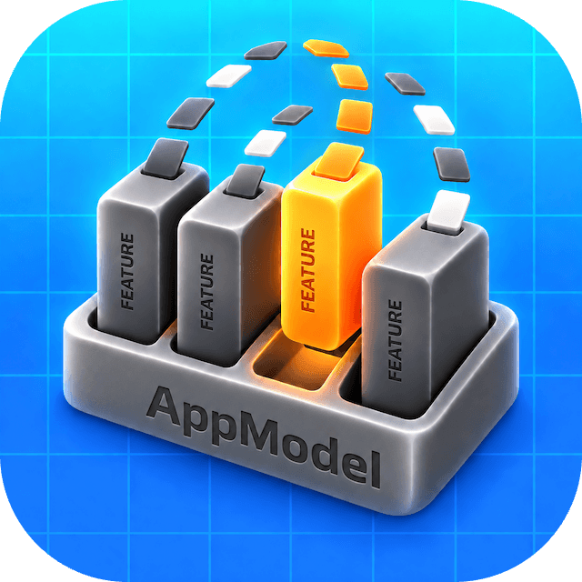
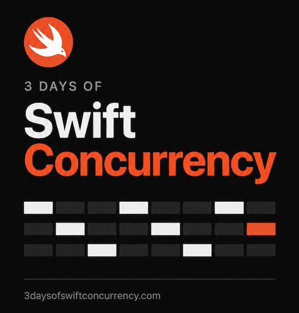

<p align="left">
  <a href="https://github.com/3DaysOfSwift/cooperative-feature-architecture">
    
  </a>
</p>

# Cooperative Feature Architecture (CFA)

**CFA is a modern iOS app architecture for commercial Xcode projects.** It was
created by iOS developers with 17 years of experience building, publishing
and maintaining iOS applications. CFA gives SwiftUI, ViewModels, Feature
Managers, repositories and Swift Concurrency clear responsibilities, so a team
can build faster and maintain the result with confidence.

Its structure is visible in Xcode from the first day. This shortened map uses
[Trend](https://github.com/3DaysOfSwift/Trend-iOS-App-Swift-Concurrency-CFA) as
an example and expands its feature area:

```text
Application
├── 1 - View
├── 2 - AppModel
│   ├── AppModel.swift
│   └── Features
│       ├── Habits
│       │   ├── HabitsManager.swift
│       │   └── HabitsWorker.swift
│       ├── WeightLog
│       │   ├── WeightLogManager.swift
│       │   └── WeightEntry.swift
│       ├── Progress
│       │   └── ProgressManager.swift
│       ├── Purchases
│       │   └── PurchaseManager.swift
│       ├── Settings
│       │   └── SettingsManager.swift
│       └── Backup
│           └── BackupManager.swift
├── 3 - App Resources
└── 4 - Swift Extensions
```

Each feature has one named folder. Its Feature Manager, feature-owned values
and supporting workers live together inside that folder instead of being spread
across unrelated areas of the Xcode project.

CFA is presented as a candidate for the lasting default architecture for
mainstream iOS development. The iOS industry needs more templates for scalable,
commercial Xcode projects, and this is one. CFA follows strict KISS principles,
provides guidance for AI-written code, has fewer moving parts, and gives a
developer a visible path from SwiftUI to each implemented feature and the shared
state it owns.

# Toolkit - 7 AI Skills + 1 Dashboard

**The CFA Toolkit is a free, open-source collection of seven AI skills and one
tool.** It teaches an AI coding tool how to create, change, tidy, test, migrate
and review an iOS project using the CFA architecture. The skills give the AI a
clear blueprint to follow, which makes AI-driven development more consistent
and produces a more professional Xcode project from the first feature onward.

<p align="left">
  <a href="https://github.com/3DaysOfSwift/cooperative-feature-architecture">
    
  </a>
</p>
Created by [3DaysOfSwiftConcurrency.com](https://www.3daysofswiftconcurrency.com/)
and released under the [MIT licence](LICENSE).

## Install the CFA Toolkit once

An AI skill is a small folder of instructions for an AI coding tool. Installing
the CFA Toolkit copies its seven skill folders into the place where your coding
tool looks for skills on your computer. When you later ask your AI to create an
iOS app, it can read the CFA architecture instructions and use CFA.

The installation does not change Xcode or your existing apps. It only makes the
CFA Toolkit instructions available to your AI coding tool.

### Codex

Download and extract the CFA Toolkit plugin release. In Terminal, change into the
extracted folder and run:

```sh
node scripts/install.mjs
```

This installs the CFA Toolkit into your personal Codex marketplace. Open a **new** Codex
conversation and paste this message:

```text
I have installed the CFA Toolkit for iOS from
https://github.com/3DaysOfSwift/cooperative-feature-architecture.
Do you have access to create and maintain iOS projects with CFA?
```

Codex should confirm that it can see the CFA Toolkit skills. From that point,
ordinary requests such as “Create a new iOS app…” can use the CFA architecture
without you having to paste its rules into every prompt.

### Claude Code and other AI coding tools

The portable CFA Toolkit skills are in the repository’s `skills` folder. Copy
all seven folders inside it, without renaming them, into the folder where your
AI coding tool reads skills.

For Claude Code, that folder is commonly `~/.claude/skills`. This command copies
the skills there for you:

```sh
node scripts/install.mjs --mode skills --skills-directory ~/.claude/skills
```

If your tool uses a different skills folder, replace `~/.claude/skills` with
that folder. Restart the AI tool or start a new conversation, then send it the
same confirmation message shown above.

You need Node.js 20 or newer to run the installer and the dashboard. If your
tool supports plain skill folders, you can copy the seven folders manually
instead of using Node.js.

For screenshots, upgrades and troubleshooting, read
[Installation](docs/INSTALLATION.md).

## Try these CFA prompts

1. `Using CFA, create a new iOS app that finds where I parked my car.`
2. `Using CFA, migrate this legacy GCD codebase to Swift Concurrency.`
3. `Using CFA, add a new feature to the tab bar but keep it locked under an IAP.`
4. `Using CFA, now that we added a new feature, tidy up the code.`
5. `Using CFA, remove the new feature and all IAP code too.`
6. `Using CFA, make sure each exposed feature is unit tested, for all features.`
7. `Using CFA, analyse our use of Swift Concurrency: do we have race conditions that could result in unexpected behaviour?`
8. `Using CFA, add colour themes to the application.`

Saying **“Using CFA”** makes your intention clear. Once your AI tool reliably
finds installed skills, a normal iOS request can use CFA too. If it does not,
say “Using CFA” or name the relevant skill from the list below.

## CFA Toolkit skills

The CFA Toolkit contains seven AI skills and one local analysis tool.

| Skill | Use it when you want to… |
| --- | --- |
| [CFA App Creation](skills/cfa-app-creation/SKILL.md) | create a new iOS app with CFA from the first screen onward. |
| [CFA Feature Work](skills/cfa-feature-work/SKILL.md) | add, change or remove a feature in a CFA app. |
| [CFA Architecture Adoption](skills/cfa-architecture-adoption/SKILL.md) | move an existing modern app into CFA one feature at a time. |
| [Legacy GCD migration](skills/swift-concurrency-migration/SKILL.md) | replace GCD, operation queues and callbacks with CFA and Swift Concurrency. |
| [CFA Architecture Review](skills/cfa-architecture-review/SKILL.md) | inspect architecture and concurrency without changing the app. |
| [CFA Codebase Tidy](skills/cfa-codebase-tidy/SKILL.md) | simplify a CFA project after feature work. |
| [CFA Unit Tests](skills/cfa-unit-tests/SKILL.md) | write and audit tests that protect real feature behaviour. |

The included **Xcode Project Dashboard** scans a Swift Concurrency project and
creates a local HTML report. It exposes task creation, task ownership, source
locations, architecture observations and imported test results.

## The CFA architecture

CFA gives every type of code a clear home:

- **View:** says what the screen looks like.
- **ViewModel:** holds the screen state and prepares it for the View.
- **Feature Manager:** owns the feature’s business rules and feature state.
- **Repository:** reads and writes data, such as a local file, database or web service.
- **AppModel:** creates the real feature managers and repositories in one place.

The path through one feature is:

```text
View → dedicated ViewModel → Feature API → Feature Manager → Repository
```

Here is a CFA folder map based on
[Trend’s](https://github.com/3DaysOfSwift/Trend-iOS-App-Swift-Concurrency-CFA)
features. Every feature has its own View, ViewModel and feature code, so a
developer can follow one feature without searching through unrelated files.

```text
Application
├── 1 - View
│   ├── App.swift
│   ├── Theme
│   │   ├── AppColourTheme.swift
│   │   └── ThemeManager.swift
│   └── Views
│       └── Today
│           ├── TodayView.swift
│           └── TodayViewModel.swift
├── 2 - AppModel
│   ├── AppModel.swift
│   ├── Features
│   │   ├── Habits
│   │   │   ├── HabitsManager.swift
│   │   │   └── HabitsWorker.swift
│   │   ├── WeightLog
│   │   │   ├── WeightLogManager.swift
│   │   │   └── WeightEntry.swift
│   │   └── Progress
│   │       └── ProgressManager.swift
│   └── User Data Storage
│       ├── Protocols
│       │   └── WeightRepository.swift
│       └── Local
│           └── LocalDataStore.swift
├── 3 - App Resources
│   ├── Assets.xcassets
│   └── PrivacyInfo.xcprivacy
├── 4 - Swift Extensions
│   └── Date+Day.swift
└── ApplicationTests
    ├── ViewModelTests
    │   └── TodayViewModelTests.swift
    └── FeatureTests
        └── WeightLogManagerTests.swift
```

`AppModel.shared` is the app’s composition root. It builds the real objects the
app needs and passes them to each feature. A Feature Manager owns feature rules;
a ViewModel owns only screen presentation state; a View stays quick to create
and simply reflects its ViewModel.

Read the full [CFA specification](architecture/cfa-specification.md) and
[Swift coding guide](architecture/swift-coding-guide.md) for the complete rules.

## What the CFA Toolkit helps your AI do

- Create a commercially structured SwiftUI project instead of a pile of files.
- Keep business decisions out of SwiftUI Views.
- Give every screen its own ViewModel.
- Keep each feature’s state and rules with the Feature Manager that owns it.
- Use Swift Concurrency with clear ownership, cancellation and ordering.
- Preserve the product’s behaviour while migrating a legacy app.
- Write meaningful tests for feature behaviour, failures and repeated requests.
- Review source code and show the evidence in a local dashboard.

## Legacy GCD migration means more than changing syntax

This is not a search-and-replace from `DispatchQueue.async` to `Task { }`.
GCD often protects important behaviour: save order, shared state, cancellation,
error delivery and the rule that an old request must not overwrite a new result.

The Legacy GCD migration skill first records that existing behaviour. It then
creates clear CFA feature boundaries and moves concurrency one feature at a
time. Builds, tests and manual regression testing check that the migrated app
still does what the original app did.

## Xcode Project Dashboard

The easiest way to create a dashboard is to ask your AI coding tool:

```text
Using CFA, analyse my Xcode project and produce a dashboard.
```

The CFA Architecture Review skill tells the AI how to inspect the project, run
the dashboard and explain the report. The dashboard runs locally and does not
edit your application.

If you prefer Terminal, the CFA installer adds a short command:

```sh
cd /path/to/your-xcode-project
cfa dashboard
```

It scans the current folder and creates a new timestamped dashboard folder
inside it. To analyse another project, give its folder path:

```sh
cfa dashboard /path/to/your-xcode-project
```

The installer places `cfa` in `~/.local/bin`. If Terminal says `command not
found: cfa`, add that folder to your zsh path once, then open a new Terminal:

```sh
echo 'export PATH="$HOME/.local/bin:$PATH"' >> ~/.zprofile
```

The dashboard can show where Tasks are created, whether a root Task is tracked,
possible suspension points, architecture observations and imported test results.
It links findings back to the source code so you can inspect the evidence.

It cannot prove that an app has no race conditions. An AI reviewer must inspect
the relevant source, and the app still needs builds, tests and manual checks.

## Apps made with CFA

These open-source iOS projects show CFA in use:

- [Cuentiva](https://github.com/3DaysOfSwift/Cuentiva)
- [Personal API iOS App](https://github.com/3DaysOfSwift/Personal-API-iOS-App-Swift-Concurrency-CFA)
- [Trend iOS App](https://github.com/3DaysOfSwift/Trend-iOS-App-Swift-Concurrency-CFA)
- [RocketLaunch iOS App](https://github.com/3DaysOfSwift/RocketLaunch-iOS-App-Swift-Concurrency)
- [Metro Mate iOS](https://github.com/3DaysOfSwift/metro-mate-ios), an open-source app migrated with CFA and Swift Concurrency.

See [Apps Made with CFA](docs/APPS-MADE-WITH-CFA.md) to learn what each project
demonstrates.

## Build the CFA Toolkit from source

If you are contributing to the toolkit itself, run these commands from a source
checkout:

```sh
npm run sync
npm run validate
npm test
python3 scripts/release.py
```

Building a release needs Python 3 and Node.js 20 or newer. There are no npm
packages to install.

Read [Contributing](CONTRIBUTING.md), the [release process](docs/PUBLISHING.md),
the [validation record](docs/VALIDATION.md) and [Privacy](docs/PRIVACY.md).

## Copyright and permission

<p align="left">
  <a href="https://github.com/3DaysOfSwift/cooperative-feature-architecture">
    
  </a>
</p>
Copyright © 2026 [3 Days of Swift Concurrency](https://www.3daysofswiftconcurrency.com/).

You may use, copy, change and share the CFA architecture and CFA Toolkit,
including in commercial work, under the [MIT licence](LICENSE).
